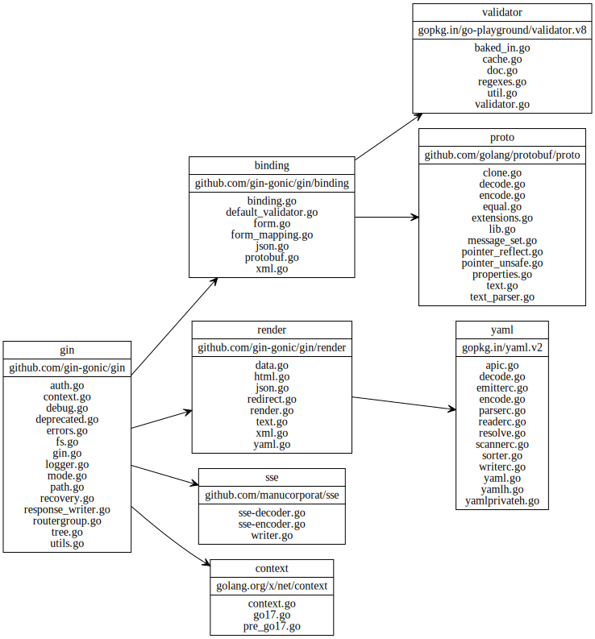
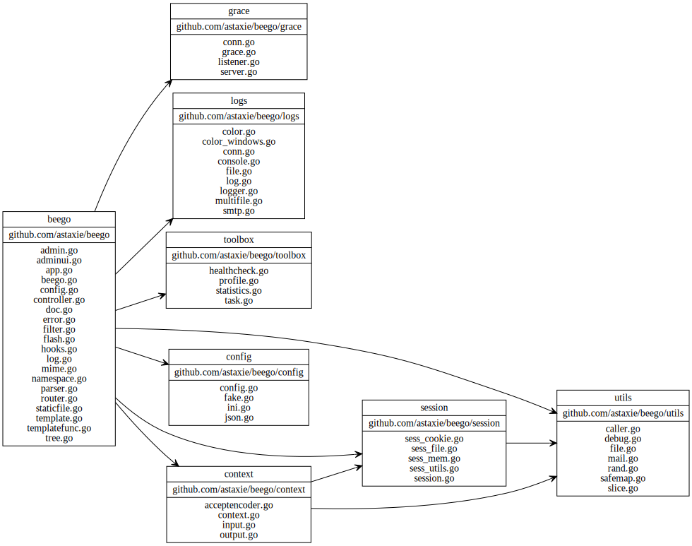
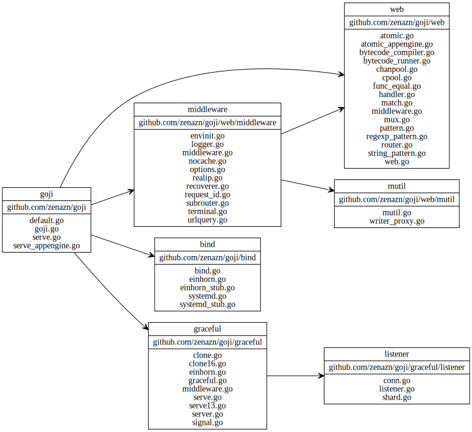
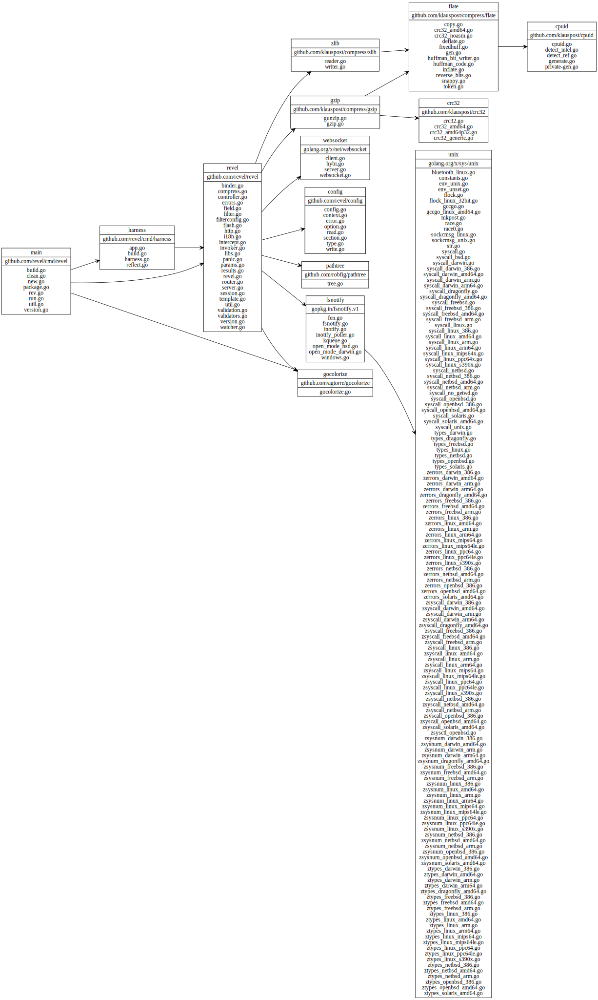
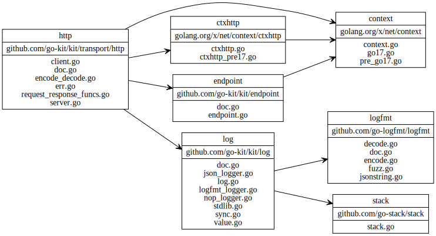
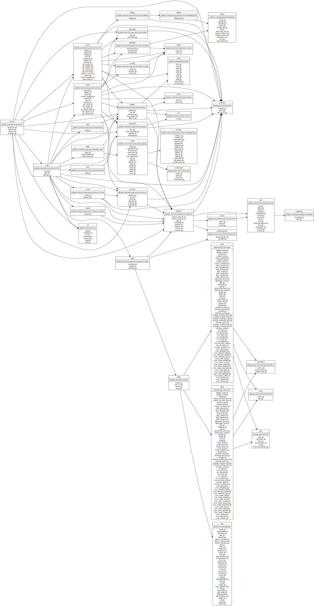
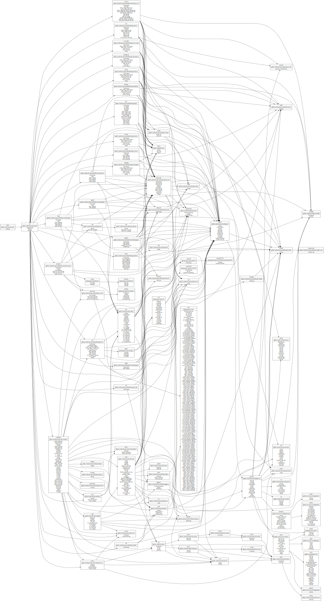
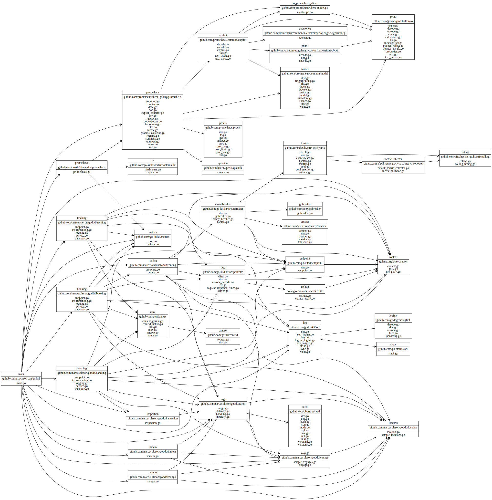
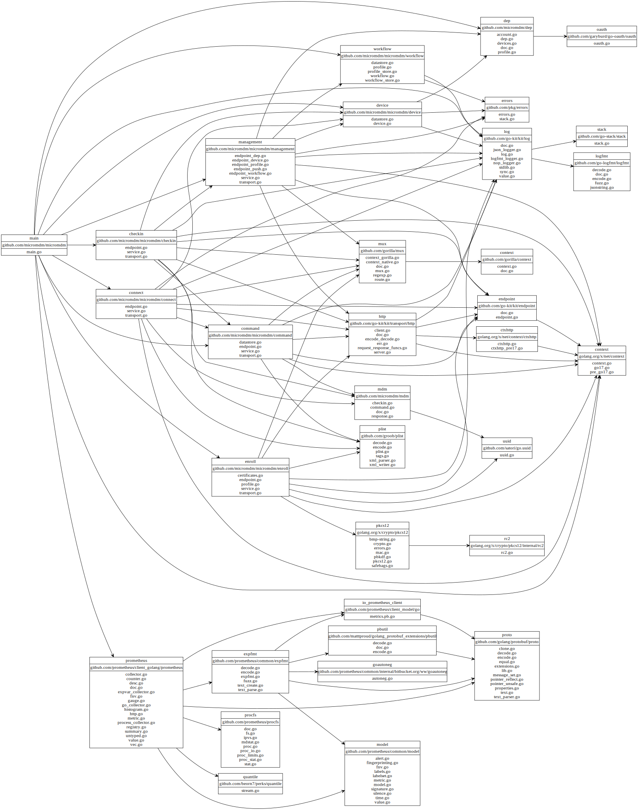
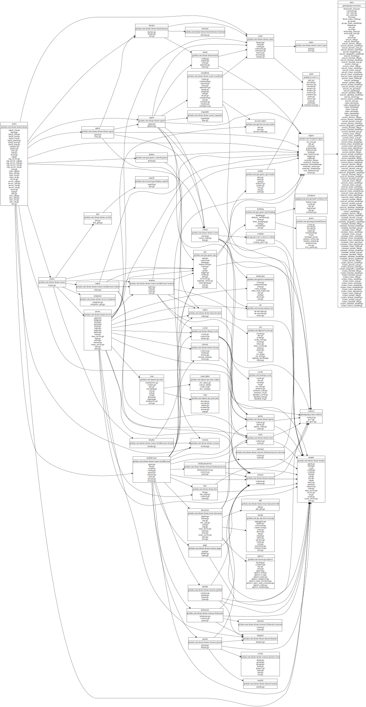

Overview
---
I used [goviz](github.com/hirokidaichi/goviz) to vizualize the dependency graphs of various Go http frameworks/libraries.
Here are the results.
What would be even more interesting is to vizualize some of the projects which are using these frameworks. 
I saved a few of the graphs in the [Sample Applications] section below.

Web frameworks
---

## Gin

https://gin-gonic.github.io/gin/

## Beego

http://beego.me/

## Goji

https://github.com/zenazn/goji

## Revel

https://revel.github.io/

Microservice Frameworks
---

## Go Kit

http://gokit.io/

## Kite

https://github.com/koding/kite

## Micro

https://github.com/micro/go-micro

Sample Applications
---

## Built with net/http

- Vault https://github.com/hashicorp/vault

## Built with go-kit

- Domain Drive Design Sample App https://github.com/marcusolsson/goddd

- SCEP Server (a single go-kit service) https://github.com/micromdm/scep

- MicroMDM (a collection of microservices packaged together)

## Built with Gin

- Drone CI https://github.com/drone/drone

